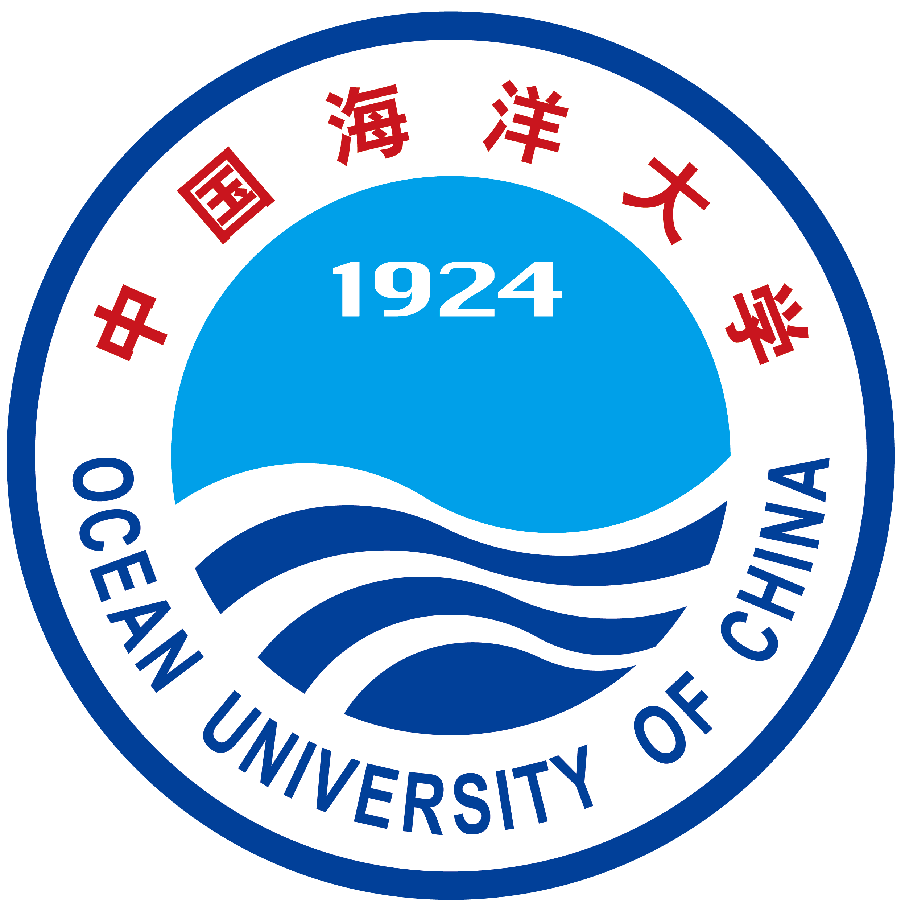

I'm currently working towards the Doctor of Engineering (D.Eng), advised by Pro.Xiujun Sun, with [Ocean University of China](https://www.ouc.edu.cn/) and [Laoshan Laboratory](https://www.lsnl.cn/). My research interest focus on **Ocean Acoustic Observation** including wave gliders, underwater acoustic signal processing, computational ocean acoustics, embedded development for towed acoustic array, etc. 

Recently, I'm interested in **AI for Marine Science & Ocean Engineering**. Deep Learning is employed to enable acoustic surveys of marine mammals, target information sensing in the marine environment and so on.

  <!-- Ocean University of China 图片和字幕 -->
  
 <!-- 增加间隔 -->
    
    
 <!-- 增加顶部间距 -->
      <b>Ocean University of China</b> 
      Undergraduate 
      Aug. 19 - Jun. 23
    

  

  <!-- Ocean University of China 图片和字幕 -->
  
 <!-- 增加间隔 -->
    
    
 <!-- 增加顶部间距 -->
      <b>Ocean University of China</b> 
      Eng.D Candidate 
      Aug. 23 - Jun. 28
    

  

  
  <!-- National Laboratory 图片和字幕 -->
  

    
    
 <!-- 增加顶部间距 -->
      <b>Laoshan Laboratory</b> 
      Eng.D Candidate 
      Aug. 25 - Jun. 28
    

  

## News
- 2024.10.25, Happy 100th anniversary of *Ocean University of China*

## Educations
- 2023.08 - 2028.06, Ocean University of China & Laoshan Laboratory, Eng.D Candidate
- 2019.08 - 2023.06, Ocean University of China, Undergraduate

## Honors and Awards
- 2024.10, Bronze Award, Huawei Ascend AI Innovation Competition 2024 (Qingdao)
- 2023.06, Outstanding Graduates Award, Ocean University of China
- 2021.12, National Grand Prize, The 3rd "Huiyuan Sharing" National University Open Data Innovation Research Competition of the Main Track

